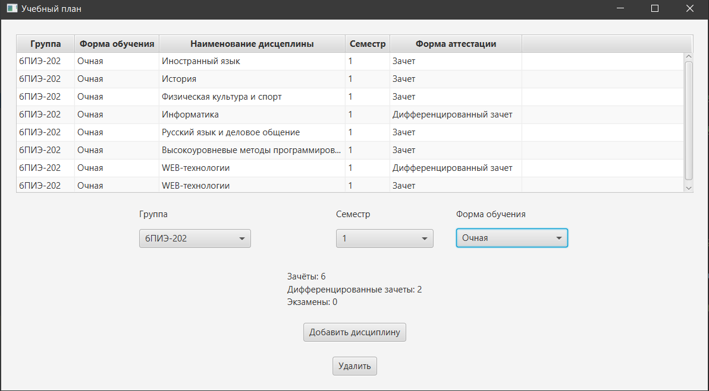
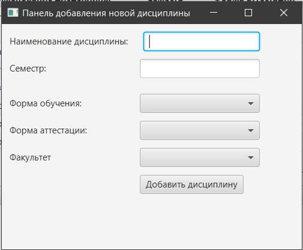

# Программа навигации по учебному плану
В рамках данного курсового проекта была разработана программа для навигации по учебному плану, которая поможет студентам и преподавателям легко и быстро ориентироваться в учебном плане, с учетом выбранных критериев, определять какая форма аттестации будет по дисциплине, а также просматривать статистику.
Также для приложения были сгенерированы javadocs, с которыми можно ознакомится в [папке]([https://github.com/NastyaSyrom/Curriculum-Navigation-Program/tree/main/JavaDoc](https://github.com/NastyaSyrom/Curriculum/tree/main/JavaDocs/JavaDocs)).
## Интерфейс программы
## Главное окно программы. 
Вывод учебного плана по заданным критериям и вывод статистики 

## Окно программы для добавления дисциплины

## Средства разработки
Для создания GUI был использован JavaFx. В качестве базы данных была использована H2.
